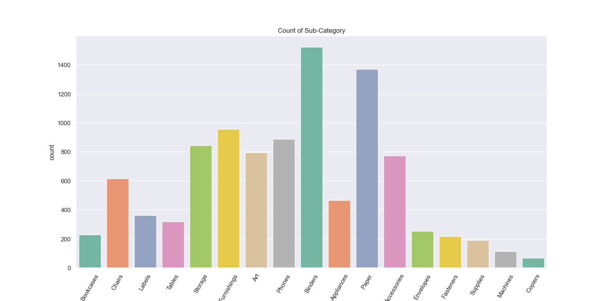
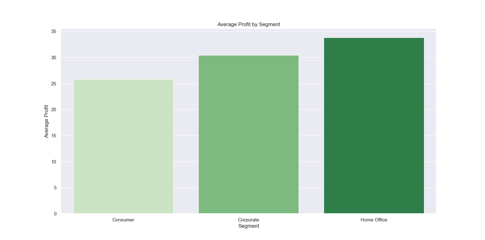
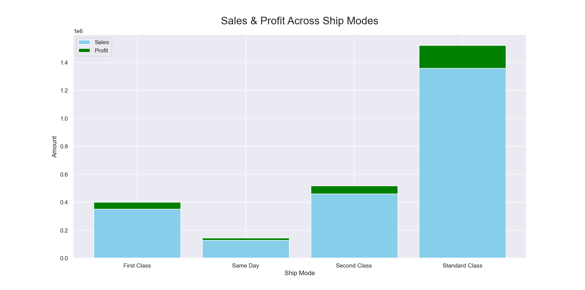
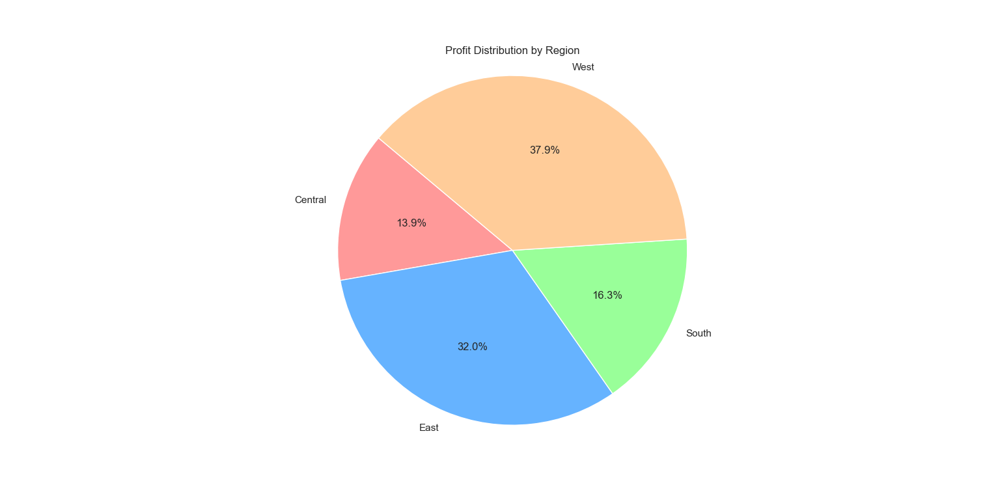

# Superstore Sales Data Analysis & Visualization 📊

## 🚀 Project Overview
This project dives deep into the **Superstore sales dataset** to extract valuable insights related to sales trends, customer profitability, shipping preferences, and regional performance.  
Using Python’s powerful data analytics libraries (`pandas`, `seaborn`, `matplotlib`), it showcases:

- Data cleaning and preprocessing techniques  
- Exploratory data analysis (EDA) with visual storytelling  
- Business-driven insights to help stakeholders make informed decisions  

## 🎯 Why This Project Stands Out
Unlike generic analyses, this project emphasizes:  
- **Robust data cleaning** ensuring accuracy and reliability  
- **Advanced visualizations** with clear annotations and professional styling  
- **Actionable insights** directly linked to business outcomes  
- **Modular and well-commented code** for easy customization and extension

## 📁 Repository Structure
superstore-data-analysis/
│
├── superstore.csv # Original dataset
├── Superstore Sales.py # Complete Python code for analysis
├── results/ # Output visualizations (screenshots)
│ ├── category_count.png
│ ├── segment_profit.png
│ ├── ship_mode.png
│ └── regional_pie.png
└── README.md # Project overview and instructions


## 📂 Files in This Repo
| File Name          | Description                          |
|--------------------|------------------------------------|
| `superstore.csv`   | Original sales dataset              |
| `Superstore Sales.py`      | Complete Python code for analysis   |
| `README.md`        | Project overview and instructions   |

## 🛠️ Technologies Used
- Python 3.x  
- pandas  
- matplotlib  
- seaborn  

## 💡 Key Insights & Visualizations

### 1. 📦 Top Performing Product Sub-Categories


---

### 2. 💰 Most Profitable Customer Segment


---

### 3. 🚚 Preferred Shipping Modes (Sales vs Profit)


---

### 4. 🌍 Profit Distribution by Region


---

## 🚀 How to Run the Analysis

1. Clone the repo or download the files
2. Make sure `superstore.csv` and `Superstore Sales.py` are in the same folder
3. Run the script using:

```bash
python "Superstore Sales.py"


📬 Let's Connect

Want to discuss or collaborate?

    📧 Email: khalidparvaiz.nit@gmail.com

    🔗 LinkedIn

    📂 GitHub
